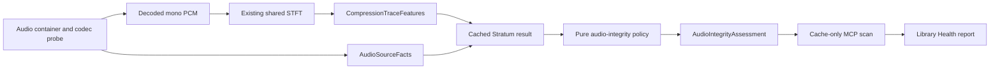

# Audio Integrity and Lossy-Source Detection Plan

**Date:** 2026-07-28
**Status:** External-transfer candidate rejected; release gate remains closed
**Primary gate:** Do not expose a definitive user-facing flag until the
real-audio benchmark passes
**Related areas:** `stratum-dsp`, Stratum audio cache, MCP analysis tools,
Library Health workflow

## 2026-07-30 implementation checkpoint

The measurement prototype, private-corpus harness, controlled transcode
generator, archive/restore workflow, and development-only evaluators now
exist. The prototype remains opt-in at feature version `0`, its result field is
not serialized, the Stratum cache remains at schema `21`, and no domain, MCP,
or Library Health verdict is enabled.

The initial Tier B pilot used 40 independent source groups, 240 negative rows
(including ordinary and sharp low-pass controls), and 320 controlled
lossy-to-lossless rows. The original edge/hole/rupture conjunction detected
only 4/320 positives at zero development false positives. Later
stereo/transform experiments did not make the explainable-only design safe:

- a nested, source-grouped two-family search using the exact transform-grid
  research probe detected 20/320 positives at the strictest zero-negative-pass
  setting, with 0/240 development alerts;
- relaxing the per-family negative-pass allowance increased recall but
  produced 4–8 alerts across untouched and PCM-control rows; and
- an external C4DM detector found 61/64 sampled positives but also labelled
  30/48 sampled negatives, including low-pass controls.

A research-only learned probe with randomized high-frequency masking was also
tested because the explainable path failed. On a separate 480-case
settings-holdout corpus (40 lossless excerpts and 440 transcodes at 11 unseen
codec settings), the two pre-existing model ensembles plus frozen DSP
conjunctions detected 266/440 and 242/440 respectively; the second policy
alerted on one Tier B excerpt. Requiring both policies to agree retained
215/440 and removed that alert, but this consensus rule was chosen after
observing the settings-holdout result. It is therefore a candidate for a new
untouched gate, not validation evidence, and it conflicts with the current
“no neural classifier in version 1” decision.

High-bitrate AAC remains deliberately inconclusive: AAC LC at 320 kb/s was
effectively undetected. The held-out labels remain unopened. The next release
decision requires a disjoint Tier A corpus with at least 150 documented PCM
negative masters, hard-negative coverage, and an approved data licence or
owner-provided source. Until then, the PR 2 stop gate below remains in force.

The release procedure is now mechanically fail-closed. A private command seals
an opaque Tier A manifest into a label-free benchmark manifest plus a hashed
label file. A separate freeze command commits to the development
manifests/fingerprints, explainable two-family policy, release targets, exact
DSP runner, benchmark harness, gate implementation, and still-unopened seal.
The one-shot evaluator verifies source-group disjointness and every commitment
before changing the seal to `labels_opening`. A separate `partition_group`
commitment also keeps the same performer, artist, recording session, or source
collection from appearing on both sides under different master IDs. Any crash
or failure after label opening consumes the held-out set. The evaluator reports
Wilson 95% intervals, class coverage, hard-negative outcomes, invariant deltas,
p95 runtime overhead, and complete-corpus isolated-process peak RSS. Even a
passing evaluation keeps the public verdict disabled until explicit
integration review.

The memory path has also been exercised with an optimized baseline/prototype
runner smoke test. This validates the measurement plumbing only; it is not
corpus evidence. The reusable Tier B, unseen-codec-settings, and research
artifacts remain in their verified private archives, while redundant working
audio and reproducible scratch trees have been removed.

## 2026-07-31 public-corpus and refinement checkpoint

Four reviewed CC BY 4.0 source packages are now preserved with provider
checksums and immutable fetch records. A deterministic stager selected 48
documented PCM development partitions: 6 GuitarSet players, 20 VocalSet
singers, 9 Groove drummers with released audio, and 13 ChoraleBricks
instrument/performer partitions. The sealed public controlled corpus contains
288 cases from those masters: 96 PCM negatives and 192 MP3, AAC-LC, Opus, and
native-FFmpeg-Vorbis intermediates decoded back to FLAC. The final lossless
files, commands, encoder build, intermediate hashes, parent seals, provenance,
and exact verification path are retained; only the reproducible lossy
intermediates were removed.

Adding the public data and 48 kHz PCM controls produced an 88-partition
development set with 936 cases: 424 negatives and 512 controlled positives.
The strongest stable two-rule explainable candidate detected 230/512 positives
with 0/424 grouped development false positives. Two leakage-safe CNN seeds,
with separate inner early-stop partitions and untouched outer folds, achieved
case-level AUC 0.9627 and 0.9767. Their ensemble detected 155/512 positives at
its zero-false-positive boundary. A learned-plus-explainable union reached
342/512 at a model floor of 0.90 but alerted on three PCM controls; raising the
floor to 0.99 removed those alerts and reduced recall to 138/512. These are
useful research signals, but none approaches the predeclared 90% development
recall target.

The two-grid stable research profile reuses the exact `mp3_long_sine` and
`long_vorbis` values from the five-grid probe. On six representative
90-second cases with five alternating repetitions, its median wall-time
overhead was 1.67%, p95 overhead was 2.15%, and p95 peak-RSS increase was
6.10%. This is a small research sample, not release-performance evidence.

All development audio, public corpora, resample controls, model weights,
feature cache, exact run sources/binaries, and reports are preserved in sealed
or verified private artifacts. The final research bundle is
`audio-integrity-research-20260731-001.tar.zst`; its SHA-256 is
`d492bc192bd6c1bce04572195f4d898d41a4ffad08dd1e39061711c363d65e7e`.
After archive and local-integrity verification, the redundant 42 GB
development restore, 1.4 GB research tree, and reproducible smoke/invalid-model
scratch were removed. The public corpora and source packages remain directly
available for future versions.

The release stop gate remains closed. No held-out release evaluation was
opened, the prototype remains disabled by default at feature version `0`, its
result remains unserialized, cache schema `21` is unchanged, and no domain,
MCP, or Library Health verdict exists. A future release attempt still needs a
disjoint, licensed or owner-provided Tier A set with at least 150 negative
partitions and a materially better candidate frozen before opening it.

## 2026-07-31 sparse-source generalization checkpoint

The official CC BY 4.0 NSynth test and validation archives are now retained
with provider MD5 values, local SHA-256 hashes, byte counts, source-page
attribution, and an immutable fetch record. They are Tier B robustness
material, not Tier A ground truth: the notes are 16 kHz commercial sample
library recordings and their original PCM provenance is not documented. The
official test and validation splits are each disjoint from training, but their
53 numeric instrument IDs overlap one another. The current corpus therefore
uses only the test split and retains validation untouched for future work.

The deterministic test-split stager selects eight rank-spaced notes for every
instrument and makes a 30-second montage. It retains the native 16 kHz PCM
montage and a 48 kHz stereo PCM-only resample as negatives, plus MP3 128,
AAC-LC 128, Opus 96, and native-FFmpeg-Vorbis quality-3 intermediates decoded
back to FLAC. The resulting integrity-sealed corpus has 53 instrument
partitions and 318 cases: 106 negatives and 212 controlled positives. Exact
note/member hashes, transforms, intermediate hashes, encoder build, manifests,
fingerprints, and provenance remain reusable; only reproducible lossy
intermediates were removed.

Applying the previously selected candidates without retraining or threshold
fitting exposed poor sparse-source transfer:

- the frozen two-rule stable policy detected 44/212 positives (20.8%) and
  alerted on one native 16 kHz PCM montage;
- the frozen two-seed CNN reached AUC 0.712 and detected 25/212 at its
  development-only zero-false-positive boundary; and
- measuring all five research grids and selecting templates inside grouped
  folds improved the stable explainable result to 68/212 (32.1%) at 0/106
  false positives. A looser search reached 112/212 (52.8%) but alerted on 14
  PCM negatives.

Three instrument-grouped CNN runs trained within NSynth reached AUC 0.9812,
0.9768, and 0.9834. Individually they detected 152, 132, and 156 of 212
positives at their zero-false-positive boundaries. Averaging the three
out-of-fold scores detected 189/212, and its union with the stable rules
detected 193/212 (91.0%) with 0/106 grouped-development false positives. This
is not a gate pass: the third seed, ensemble size, score boundary, and union
were all examined on this Tier B development corpus.

The cross-domain check rejected that apparent solution. Scoring the unchanged
three-seed NSynth ensemble across every fold model on the earlier 936-case,
88-partition development corpus produced AUC 0.746. At the NSynth-fixed
boundary it detected 42/512 positives and alerted on two ChoraleBricks PCM
cases. At a boundary recalibrated to zero false positives on the older corpus,
it detected only 7/512. The high in-domain result is therefore a
source-domain shortcut, not a general lossy-history detector.

This checkpoint strengthens the existing stop decision. It does not justify
opening the release set, lowering the 90% recall target, accepting false
positives, freezing feature version `1`, or adding a public/cache/MCP verdict.
Further candidate work needs broader source-domain training and an untouched,
licensed or owner-provided Tier A gate with at least 150 negative partitions.

The exact candidates, feature cache, three sets of fold checkpoints, frozen
and grouped evaluations, cross-domain rejection, executed runner, source
snapshots, provenance, and retention ledger are preserved in
`audio-integrity-nsynth-research-20260731-001.tar.zst`. The verified archive
contains 80 files, is 98,011,998 bytes, and has SHA-256
`e0957543f8ea79e2b7313202151162974ead3dba8031fc058766edb7c6b1a0a2`.
After verification, the 151 MB research root, 613 MB Python/Torch environment,
395 MB legacy-cache extraction, superseded reports, and obsolete fetch record
were removed. The canonical fetch record, both source archives, the reusable
318-case corpus, active pointers, and all prior verified archives remain.

## 2026-07-31 source-domain holdout checkpoint

The prior 936-case development cache and the 318-case NSynth cache were
restored from their independently verified research archives and merged under
a fail-closed evidence record. The merger revalidated both complete archive
hashes, streamed the named cache members, checked the exact feature definition,
tensor shape and finiteness, five clip indices per case, case identity, domain
mapping, and non-overlap. The merged development cache contains 1,254 cases,
6,270 clips, 141 independent partitions, 530 negatives, and 724 controlled
positives across six macro source domains:

- the 40-partition private full-mix corpus;
- GuitarSet, VocalSet, Groove, and ChoraleBricks as four separate Tier A
  domains; and
- NSynth as a Tier B sparse/bandwidth-limited domain.

A leave-one-source-domain-out runner then excluded each complete corpus in
turn. Epoch selection used only partition-grouped inner validation data
stratified across every remaining domain. Each decision boundary was the
maximum negative score from that same inner validation set and was applied
unchanged to the excluded corpus. Outer-domain labels were not used for epoch
or boundary selection. This is a stricter generalization check than the prior
random source-group folds and remains development-only rather than release
evidence.

Five controlled experiments all failed the frozen target:

| Representation / training change | False positives | Positives detected |
| --- | ---: | ---: |
| Absolute spectrogram, BatchNorm baseline | 33/530 | 413/724 (57.0%) |
| Content-residual channels | 99/530 | 539/724 (74.4%) |
| Within-source paired ranking | 53/530 | 170/724 (23.5%) |
| Absolute spectrogram with GroupNorm | 24/530 | 383/724 (52.9%) |
| GroupNorm plus equal source-domain sampling | 34/530 | 495/724 (68.4%) |

The failure modes are informative. The BatchNorm baseline mostly confused
sharp low-pass private controls and transferred poorly to NSynth. Removing the
absolute spectral envelope raised recall but labelled 51/53 untouched NSynth
resample controls as lossy. Within-source ranking achieved near-zero training
loss but lost cross-source calibration. GroupNorm removed dependence on
training-corpus running statistics and produced the best false-positive count,
but its conservative NSynth boundary detected only 4/212 transcodes. Equal
domain sampling recovered 88/212 NSynth positives while adding 15/106 NSynth
false positives. No variant approached zero false positives and 90% recall at
the same time.

This checkpoint rejects random-fold and in-domain accuracy as promotion
evidence and keeps the stop gate closed. It does not open the sealed release
set, change feature version `0`, serialize the prototype result, bump cache
schema `21`, or enable a domain, MCP, or Library Health verdict. Further model
work needs a genuinely domain-invariant codec-artifact signal or a different
conservative product contract; threshold tuning on these observed outer
domains would not supply valid evidence.

The exact merged-cache evidence, five case-level reports, 30 fold checkpoints,
trainer/merger/domain-map snapshots, tests, comparison, and retention ledger
are preserved as
`audio-integrity-domain-generalization-research-20260731-001.tar.zst`.
The verified archive contains 60 files, is 6,370,432 bytes, and has SHA-256
`6fcbed9effdc0bb61bc94fe75f86aac163e3147adaec2e4c390c5e7fc7255253`.
Reproducible extracted caches and the isolated Python environment are removed
only after their source archives and the final research archive pass streamed
verification. All reusable audio corpora, official source packages, and prior
verified archives remain retained for future versions.

## 2026-07-31 long-block codec-framing checkpoint

The EUSIPCO transform/framing method exposed a concrete gap in the earlier
research probe: it compared only two transform frames at each phase, while the
published method averages the energy of roughly one-second spectrogram blocks
and combines phase estimates from multiple blocks. The benchmark runner now
emits additive, research-only long-block measurements without changing the
production feature, serialized output, cache schema, or public contract.

The first three-grid profile measured the MP3 576-bin sine, 1024-bin
Vorbis/slope, and Opus 960-bin CELT candidates. On the complete public Tier A
development corpora, a strict maximum-of-grids threshold above all 144
confirmed-PCM, excerpt, and resample negatives detected 180/192 controlled
positives (93.75%): 47/48 AAC-LC, 47/48 MP3, 38/48 Opus, and 48/48 Vorbis.
This was a useful signal, but not a gate pass.

The unchanged rule failed on the 318-case NSynth robustness corpus. A sparse
PCM resample produced a phase-consistent score of 13.342, raising the combined
250-negative boundary and reducing recall to 133/404 (32.9%). Increasing the
probe from four evenly spaced blocks to as many as ten non-overlapping blocks
and requiring at least three valid peaks did not repair the failure: on the
pathological six-case source group, the same PCM resample scored 13.551 on the
Opus grid. The false peak therefore came from repeatable tonal structure, not
only from accepting too few blocks.

A development-only hybrid diagnostic then joined the long-block reports with
the previously archived leakage-safe NSynth out-of-fold CNN scores and unseen
Tier A scores. Three post-selected zero-observed-false-positive rules could fit
370/404 positives (91.6%) with 0/250 development alerts. That optimistic
result did not survive the required stability check. The analyzer refit 262
scalar rule templates inside five source-grouped folds; each fold had many
locally safe templates, but no template was both safe and useful in every
fold. The grouped disposition is therefore a hard failure, not 0% recall
evidence for an empty policy.

This checkpoint keeps the stop gate closed and avoids restoring the 42 GB
private development corpus for a candidate that already failed public
cross-source stability. The held-out labels remain unopened, feature version
`0` and cache schema `21` remain unchanged, and no result is serialized or
exposed through domain, MCP, CLI, or Library Health surfaces. The public audio
corpora remain reusable; raw reports, the failed refinement, selectively
restored CNN evidence, analysis code, and cleanup ledger are retained as a
separate verified research cycle.

That cycle is preserved as
`audio-integrity-long-block-research-20260731-001.tar.zst`. The verified
26-file archive is 2,223,655 bytes with SHA-256
`d85554740d40fbb59d1df243494f0bf484dd19cb82d6f065c684fa105f85575d`.
It includes the exact research executable, source and test snapshots, input
and output reports, integrity manifest, and ledger. The redundant repository
working copy was removed only after streamed archive verification and an
independent record/hash/list audit. The reusable corpora, private development
archive, and sealed held-out data remain retained.

## 2026-07-31 AAC quantization-error checkpoint

The JAES 2019 AAC quantization-error method was independently reproduced as a
research-only Rust probe. It evaluates all 1,024 possible AAC frame offsets,
the long/start/stop/eight-short MDCT windows, eight published scale factors,
and mono/stereo LR/MS paths. The official companion MATLAB source, exact
download hash, equations, implementation mapping, and source terms are
retained as provenance. The companion notice permits personal or research use
and prohibits commercial use, so that source is not a production dependency
and any product use would require separate legal and licensing review.

The complete public development run contained 654 cases. The probe scored 404
controlled lossy-to-lossless positives and 197 negatives; all 53 native 16 kHz
NSynth PCM montages were explicitly recorded as unsupported, while their
48 kHz PCM-only resample controls were scored. At the paper's fixed `0.031`
boundary, it detected 308/404 positives (76.24%) but alerted on 44/197
negatives (22.34%). Forty-three of those alerts were NSynth PCM-only resamples
and one was a Tier A PCM-only resample. A strict boundary above every observed
development negative detected only 17/404 positives (4.21%).

Retaining every 1,024-offset probability curve allowed a predeclared
shape-based follow-up without rerunning audio. None of ten scalar summaries
separated the classes safely: the best strict scalar detected 56/404
positives with 0/197 alerts. An optimistic one-guard rule selected on all
development labels fit 80/404 with 0/197, while five source-group outer folds
detected 84/404 with 4/197 false alerts. The grouped disposition is
`failed_development_grouped_gate`.

The published natural-music result therefore does not transfer to this
hard-negative development mix. The method is retained as negative evidence,
not promoted or tuned further. The held-out labels remain unopened, feature
version `0` and cache schema `21` remain unchanged, and no result is
serialized or exposed through domain, MCP, CLI, or Library Health surfaces.
The exact independent probe and executable, reference source, raw reports,
complete offset curves, grouped analysis, tests, provenance, and cleanup
ledger are preserved in
`audio-integrity-aac-quantization-research-20260731-001.tar.zst`. The verified
27-file archive is 2,491,705 bytes with SHA-256
`0ac3cab6c16a10b60a13467330edd6ba6867fd0066f73ea59f8b7dfd54de3a10`.
The redundant 22 MB repository research tree was removed only after streamed
verification and an independent record/hash/list audit. All three public
audio corpora remain directly reusable for future versions.

## 2026-07-31 ISMIR 2024 CRNN source-domain checkpoint

The materially different CNN plus bidirectional-LSTM method from “Robust
Lossy Audio Compression Identification” (ISMIR 2024) was reproduced as a
paper-aligned independent implementation. It uses two-second 44.1 kHz mono
inputs, 1,024-point magnitude spectrograms, a random 14 kHz-to-Nyquist
training mask, four convolution/ReLU/batch-normalization/pooling blocks, and a
two-layer bidirectional LSTM with hidden size 128. The paper does not specify
convolution channel counts, spectrogram hop/window defaults, optimizer,
learning rate, batch size, or training schedule, and no author source release
was located. The local choices were therefore documented and frozen before
the run; this is not an exact reproduction claim.

The evaluation was stricter than the paper's random track split. Each of the
five complete source domains was held out in turn, inner early stopping was
source-grouped, and the decision boundary was fixed above all inner PCM
negatives. The frozen input contained 654 cases from 101 independent source
groups: 404 controlled lossy-to-lossless positives and 250 PCM, excerpt,
resample, sparse, or bandwidth-limited negatives.

The combined outer-domain result detected 46/404 positives (11.39%) while
alerting on 27/250 negatives (10.8%); AUC was 0.5155. Three Tier A folds
detected no positives. VocalSet detected 12/80 with 9/60 false alerts, and
NSynth detected 34/212 with 18/106 false alerts. No source domain approached
the predeclared 90% recall with zero false positives.

The required source-group diagnostic rejects a codec interpretation even more
clearly. Fourteen of the 15 source groups with any alert also alerted on a
confirmed PCM negative, and nine groups alerted every available variant. All
21 VocalSet alerts were every one of seven variants—including all three PCM
controls—from the same three singers. In NSynth, six instruments alerted all
six variants and 11 of 12 alerted instruments included a PCM false alert. The
disposition is `failed_source_group_specificity_check`: the model learned
source identity, not transferable codec history.

This result closes the CRNN candidate without threshold tuning or held-out
access. Feature version `0`, cache schema `21`, and
`likely_lossy_derived_enabled: false` remain unchanged. The exact paper,
environment lock, implementation, tests, five checkpoints, raw case
predictions, grouped diagnostic, input commitments, and cleanup ledger are
preserved in a separate private research archive before the cycle-specific
environment and cache are removed. The three reusable public audio corpora
remain outside the cleanup target.

The completed cycle is preserved as
`audio-integrity-ismir2024-crnn-research-20260731-001.tar.zst`. The verified
31-file archive is 89,482,692 bytes with SHA-256
`1537bd44e6667ced3dba649713e834baacd485567ad64d375e65cb159cc703c7`.
It passed the archive helper's streamed per-file verification, an independent
hash comparison, `zstd --test`, and a complete tar-member audit. The redundant
95 MB research root was then removed by the guarded archive-prune command.
The 466 MB Python environment and 432 MB package cache were moved to macOS
Trash as a recoverable cleanup step. The three reusable corpora, archive,
record, ignored pointer, and sealed held-out data remain retained.

## 2026-07-31 source-paired CRNN checkpoint

One frozen objective was tested to directly penalize the source shortcut in
the paper-aligned CRNN. Each training item paired a generated PCM control and
a controlled lossy-to-lossless variant from the same source, using the same
relative crop and the same random high-frequency mask. Cross-entropy was
combined with a margin-ranking loss requiring the lossy member's log odds to
exceed its PCM control. All eligible within-source pairs were used once per
epoch. The model architecture, margin, loss weight, batch size, optimizer,
outer domains, inner selection rule, and strict boundary were fixed before
the run.

The same 654-case, 101-source development corpus and five complete
source-domain outer folds were used. The frozen run detected 86/404 positives
(21.29%) and alerted on 48/250 PCM negatives (19.2%); pooled AUC was 0.5139.
No outer domain passed:

- ChoraleBricks: 0/52 positives and 0/39 false alerts;
- Groove: 2/36 positives and 0/27 false alerts;
- GuitarSet: 0/24 positives and 0/18 false alerts;
- VocalSet: 0/80 positives and 0/60 false alerts; and
- NSynth: 84/212 positives and 48/106 false alerts.

The paired loss improved within-source ordering on Tier A: per-domain
within-source AUC ranged from 0.795 to 0.972. It did not supply a transferable
absolute boundary, and it inverted on sparse NSynth audio to within-source AUC
0.288. Twenty-eight NSynth groups included a PCM alert and 20 alerted every
one of their six PCM and codec variants. Native 16 kHz PCM montages alerted
more often (28/53) than AAC, MP3, or Opus (20/53 each).

The disposition is `failed_source_group_specificity_check`. This loss and its
boundary must not be tuned against the observed outer labels. The result
strengthens the conclusion that blind universal classification is not yet
supported across natural full-mix, isolated voice/instrument, and sparse
synthetic source domains. The held-out labels remain sealed, feature version
`0` and cache schema `21` remain unchanged, and no public verdict is enabled.
The exact runner, tests, environment, five checkpoints, case predictions,
grouped diagnosis, and input commitments are retained in a separate verified
research archive before removing the cycle-specific scratch.

The completed paired cycle is preserved as
`audio-integrity-source-paired-crnn-research-20260731-001.tar.zst`. The
verified 29-file archive is 88,572,167 bytes with SHA-256
`6035bad31d7bb4b2318a3383ba3c4b4ff0234ca4977d965519d6b615eacb9a93`.
It passed the helper's streamed per-file verification, an independent hash
comparison, `zstd --test`, and a 46-member tar audit. The guarded prune then
removed the 94 MB research root, and the 466 MB Python environment was moved
back to macOS Trash as a recoverable cleanup step. All three reusable corpora,
the new and predecessor archives, records and pointers, and sealed held-out
data remain retained.

## 2026-07-31 broad sparse-training transfer checkpoint

The source-paired failure justified one frozen broader-training experiment,
not another fit against the already-observed 101-source transfer labels. Two
development-only training corpora were prepared and retained:

- a verified private full-mix archive was streamed one member at a time into a
  1.9 GB compact corpus without a full restore: 520 thirty-second FLAC cases
  from 40 groups, comprising 200 PCM negatives and 320 controlled positives
  across eight lossy codec settings; and
- the official CC BY 4.0 NSynth train JSON/WAV archive was retained at
  23,815,298,079 bytes with provider MD5
  `fde6665a93865503ba598b9fac388660` and local SHA-256
  `15c5100fc40c3a262f9b42707c15ffed30b8fec58c0d9b88d4136f6cb1fddefe`.
  Google documents that train instruments do not overlap validation or test.
  A deterministic family/source-stratified subset of 200 train instruments
  produced 1,200 cases: 400 PCM controls and 800 MP3, AAC-LC, Opus, or Vorbis
  intermediates decoded back to FLAC.

Both corpora passed full fingerprint/seal verification plus independent
manifest, file-inventory, retention, and decoder audits. The raw official
archive, derived sparse corpus, compact private corpus, original verified
private archive, and the three earlier public transfer corpora are not cleanup
targets. Their durable inventory is
`retained-corpora-inventory-20260731-001.json`, SHA-256
`3c70907f2d554dcc311aeccb8bfb4c1bee7be3f05c9a092938148a7d8aadc59f`.
It accounts for 2,374 sealed cases: 1,720 training cases in 240 groups and 654
development-transfer cases in 101 groups.

The paired CRNN architecture and objective were unchanged. The training-only
selection used 20% source-group validation within each of the private
full-mix and NSynth-train domains. The checkpoint order, random seed, batch
size, optimizer, learning rate, maximum epochs, patience, and strict boundary
above all inner PCM scores were frozen before transfer. The first execution
found a missing training-domain adapter during epoch-one inner validation and
failed before any checkpoint, transfer score, or report existed. The exact
empty output directory was removed; a regression test and real MPS scoring
smoke proved the implementation-only fix. Attempt two was separately refrozen
without changing any scientific setting or reading a transfer score.

The selected epoch-four checkpoint was already weak on training validation:
5/224 controlled positives at 0/120 PCM alerts, recall 2.23%, AUC 0.5604. The
one permitted transfer run then detected 20/404 positives (4.95%), alerted on
11/250 PCM negatives (4.4%), and produced AUC 0.5228:

- ChoraleBricks: 0/52 positives and 0/39 false alerts;
- Groove: 20/36 positives and 11/27 false alerts;
- GuitarSet: 0/24 positives and 0/18 false alerts;
- VocalSet: 0/80 positives and 0/60 false alerts; and
- NSynth: 0/212 positives and 0/106 false alerts.

The independent source-group check again rejects a codec-history
interpretation. All alerts came from five Groove drummer groups; four also
alerted PCM, and three alerted every one of their seven PCM and codec
variants. The disposition is `failed_source_group_specificity_check`.
Broadening disjoint training did not rescue the blind classifier, and this
observed transfer set must not be used to tune another successor.

The release-held-out labels remain sealed, feature version `0`, cache schema
`21`, and `likely_lossy_derived_enabled: false` remain unchanged. A new
candidate would require a materially different, explainable method and a new
untouched source collection; it must not merely add another neural objective
or lower the zero-false-positive gate.

The complete failed cycle is retained in the verified 58-file private archive
`audio-integrity-broad-sparse-training-research-20260731-001.tar.zst`
(18,235,323 bytes, SHA-256
`58117eb89a4a41901ed92e07316e339f8a245ba6f23edb02143087e586bc87c7`).
It preserves both frozen commitments, the pre-transfer failure record,
training and analysis implementations and tests, corpus/source metadata
snapshots, exact environment lock, checkpoint, partial and final reports,
case-level predictions, grouped diagnosis, documentation snapshots, and the
final verification record. The helper's full integrity check, independent
SHA-256, zstd stream test, and regular-file member audit passed before the
guarded prune removed the 27 MB research root. The cycle's 466 MB Python
environment was moved to macOS Trash and remains recoverable. All 2,374
retained audio cases, both retained sources, pointers, prior archives, and the
sealed release-held-out material remain untouched.

Repository verification passed 80 audio-integrity Python tests with 12 opt-in
skips, formatting, linting, release compilation, version/help checks, and the
52-tool MCP smoke with no protocol violations. One full workspace test
invocation returned exit 101 after an individual binary-test failure was lost
to truncated output; the immediate identical quiet rerun passed every suite.
That intermittent failure is preserved in the archive rather than being
reported as an unqualified clean test history.

## 2026-07-31 explainable SQAM external-transfer checkpoint

The published JAES AAC quantization method was extended, without changing its
default 8x8 research mode, to the paper companion's 16x16 sampling setting and
fixed `0.019` threshold. The exact 144-case development run was independently
repeated with the final binary. After removing only timestamps, elapsed time,
and runner-path/hash metadata, the two reports were byte-identical.

A conservative two-family candidate then required:

- enough wide-band, non-sparse audio support;
- AAC quantization probability above the published 16x16 threshold; and
- either four-block transform-frame alignment or a persistent spectral
  envelope discontinuity.

The first complete 351-case audit detected 37/39 supported AAC positives and
alerted on 0/250 negatives, but one PCM excerpt/resample pair changed support
state because active bins were expressed as a fraction of a different Nyquist
bandwidth. That version was rejected. A separately precommitted successor
normalized active-bin fraction to a 44.1 kHz physical-bandwidth reference. It
retained 37/39 supported detections, 0/250 alerts, and removed every support,
assessment, and verdict mismatch across the 48 PCM pairs. Coverage remained
deliberately narrow: only 39/101 positives were eligible and the rest were
Inconclusive.

Before inspecting any EBU SQAM feature score, the exact policy, thresholds,
source ZIP, selection, transforms, two runners, evaluators, environment, and
external-transfer gates were frozen. The official 70-item FLAC package then
produced a reusable 2.0 GB corpus:

- 70 extracted source items;
- 700 frozen-candidate cases across two PCM negative classes, AAC-LC 96/128/192
  round trips, gain/trim/resample invariants, and FLAC/WAV/AIFF wrappers; and
- 280 retained but unscored MP3, Opus, and Vorbis-to-FLAC cases for future
  methods.

Every lossy intermediate was hashed with its exact FFmpeg command and build,
then removed as reproducible scratch. All extracted sources and 980 final
lossless cases remain integrity-sealed for future versions.

The one-use external-transfer gate rejected the candidate:

- both the PCM reference and transparent resample for one Bach organ source
  alerted, producing 2/140 case false positives from 1/70 source groups;
- AAC-LC 96 detected only 29/38 supported cases (76.3%), below the frozen 90%
  target;
- AAC-LC 128 detected 37/39 supported cases (94.9%), but four source groups
  changed support or assessment under the frozen wrapper/gain/trim/resample
  invariants;
- AAC-LC 192 detected 14/37 supported cases (37.8%) and therefore remained a
  difficult-codec fallback; and
- pooled supported recall was 263/308 (85.4%) at 55.0% positive coverage.

The shared-STFT prototype portion recorded 0.66% median and 8.03% p95 overhead
on the 700 cases, but the separate 16x16 quantization stage is not integrated
or performance-qualified for production. The SQAM source is now observed
evidence and cannot be reused as an untouched gate for a successor. It is also
only a 70-item Tier B external transfer set, not the required 150 independent
Tier A uncompressed-path masters.

No threshold was tuned after opening. The release-held-out labels remain
sealed, feature version `0`, cache schema `21`, and the public verdict remain
unchanged. The failed candidate, raw reports, exact freeze, and retained corpus
are preserved so a future materially different method can reproduce the
failure without regenerating or relabelling it.

The retained-corpus inventory was advanced without overwriting its predecessor.
Inventory `audio-integrity-retained-corpora-20260731-002` commits to 3,354
cases in total: 1,720 training, 654 previously observed development-transfer,
and 980 observed SQAM external-transfer cases. The SQAM corpus contains 140
PCM controls and 840 controlled positives; its 280 MP3, Opus, and Vorbis cases
were not scored by this candidate and remain useful for future methods.

The complete cycle evidence was archived as
`audio-integrity-explainable-sqam-research-20260731-001.tar.zst`:

- 5,233,466 bytes, SHA-256
  `49b2b23ea4e16fb79627e7d359df184d0d86107d2f52f902bee74295b890c940`;
- 106 files committed by the embedded integrity manifest, plus that manifest;
- successful Zstandard integrity, safe path/type, exact inventory, byte-size,
  and independent per-file SHA-256 verification.

Only after those checks passed, the exact research directory, cycle-specific
Python environment, Python bytecode cache, four reproducible `/tmp` reports,
and rendered paper pages were moved into the recoverable Trash bundle
`reklawdbox-audio-integrity-cleanup-20260731-001`. The durable SQAM corpus,
official source ZIP, active pointer, inventories, archive, and sealed
release-held-out data were not moved. Their seal, integrity, source, and
inventory hashes were rechecked after cleanup.

## 2026-07-31 conservative two-grid successor checkpoint

The failed SQAM rule was not retuned. Its complete corpus and outcomes became
observed development evidence, and profiles v17 through v27 were measured and
rejected. The current materially different successor,
`conservative-two-grid-edge-v28`, omits both expensive Opus grids and runs only
the MP3 576-sample sine and 1,024-sample Vorbis transform-periodicity grids.
The policy requires sample-rate-normalized wide-band support, a persistent
spectral edge, and at least one of three transform branches. Every positive
therefore has the two separate reason families
`persistent_spectral_edge` and `transform_frame_periodicity`.

On all 1,634 currently observed cases, the candidate produced 0/196 supported
negative alerts. It passed the frozen 90% supported-recall target for every
scoped public and SQAM AAC-LC 96/128, MP3 128, and native Vorbis q3 class. It
also preserved all 48 public PCM excerpt/resample pairs and all 70 SQAM AAC
wrapper/gain/trim/resample groups. The shared candidate policy was replayed
against the predecessor evaluator and reproduced all 1,634 support states,
branch sets, and 493 positive decisions with zero mismatches. These results
were selected on observed labels and are development evidence only.

A paired full-pipeline audit used 16 stratified Tier A cases with three
alternating isolated-process repetitions per mode. Median and p95 wall-time
overhead were 0.75% and 3.09%; p95 peak-RSS growth was 6.07%. The exact
performance-qualified runner has been copied into the research cycle and
locked by SHA-256 so later builds cannot replace the executable used for a
one-use transfer. A subsequent release rebuild from the formatted current
source reproduced that executable byte-for-byte.

The successor transfer source was the official MUSDB18-HQ package: 150
documented uncompressed stereo 44.1 kHz full-mix WAV tracks. A verified HTTP
Range reader retained one central 30-second PCM excerpt from each ZIP member
without retaining the 22.7 GB archive. Provider metadata, ZIP inventory,
member CRC32/full-member SHA-256, excerpt location, final SHA-256, and the
educational/non-commercial local-research restriction are retained. All 150
excerpts passed independent verification before any feature score was opened.
The 783,818,603-byte acquisition has state SHA-256
`1939714cf89c1f06b29932278e79cd1b79b8e102d177e4751d5104ee05eae02c`.

The frozen controlled plan retained 1,770 lossless cases:

- 600 Tier A negatives across untouched PCM, a cascaded steep 16 kHz PCM
  low-pass, a gentler 19 kHz PCM low-pass, and PCM-only 32 to 44.1 kHz
  resampling;
- 600 recall-gated positives from FFmpeg-native AAC-LC 128, Apple AudioToolbox
  AAC-LC 128, MP3 128, and native Vorbis q3 intermediates;
- 450 non-recall-gated difficult observations for AAC-LC 192, MP3 320, and
  Opus 96; and
- 120 AAC-LC wrapper, gain, and 137-sample-trim variants over a deterministic
  30-source subset.

The stager is fail-closed and resumable. It uses atomic outputs and per-group
journals, verifies every source and final fingerprint, records exact FFmpeg
commands/builds plus lossy-intermediate hashes, removes those intermediates
only after the journal is durable, and stops before breaching a 15 GiB
free-space reserve. The first pre-feature staging attempt stopped after eight
groups because the exact FFmpeg build lacked the optional SoX resampler. That
root was inspected and moved to a recoverable Trash bundle without opening a
feature score. A successor plan changed only the PCM resampler to the built-in
SWR engine and added executable probes for all three PCM and seven lossy
recipes before creating the new root.

All 1,650 transformation groups completed and produced 1,770 retained cases.
Independent verification re-hashed every final audio file, found no partials,
and confirmed the exact candidate precommit. The final 5,837,637,248-byte
tree has seal SHA-256
`0f85343e140d3c0187156c58c9d88a90baa39807fcfd76c1ee50307e68a60318`,
manifest SHA-256
`2ce90de2ddeb9a6ab7503341c7d1a0944ea39591bc8c687ee18eca7ef4d43208`,
and fingerprint-map SHA-256
`a17ce243d62ae86238a596214237fb8206d2befc423e92ea3f7565d480edd5c4`.
The final PCM/lossless corpus, provenance, manifests, fingerprints, candidate
precommit, and seals are retention artifacts for future versions.

The external gate was frozen before staging or scoring. It required zero
positives across all 600 Tier A negatives, at least 90% supported recall and
75% support coverage in each of the four scoped encoder/codec classes, zero
AAC invariant-group mismatches, two reason families for every warning, at
least 150 independent source groups, and no more than 10% p95 runtime
overhead. The AudioToolbox AAC implementation was deliberately added as a
previously unmeasured encoder transfer. Difficult high-bitrate/Opus classes
were reported but not coerced to a recall target.

Synthetic contract checks exercise both AAC encoders, safe resume, a simulated
journal recovery, the complete 1,770-case pass path, and rejection from one
injected false positive. The standard audio-integrity suite passes 92 tests
with 12 optional PyTorch skips, and both Rust research-profile tests pass.

The one-use gate rejected v28. It produced 3/600 negative false positives
across three source groups: one cascaded steep 16 kHz PCM low-pass and two
gentler 19 kHz PCM low-pass cases. Untouched PCM references and PCM-only
resamples remained 0/300. All four scoped classes passed their frozen gates
with full support coverage: FFmpeg AAC-LC 128 detected 150/150, Apple
AudioToolbox AAC-LC 128 detected 149/150, MP3 128 detected 150/150, and native
Vorbis q3 detected 150/150. All 30 AAC invariant groups matched and every
positive had both required reason families. Difficult observations were
150/150 AAC-LC 192, 22/150 MP3 320, and 0/150 Opus 96. The exact evaluation
report has SHA-256
`f04f981da65fea26bb5ed36b2410453ff9ad593c90949c01db7e5249d7c4f46c`.

No threshold was changed after opening. MUSDB is now consumed observed
evidence and cannot be reused as an untouched gate for a revised candidate.
The feature remains experimental: feature version `0`, cache schema `21`, the
unserialized result, and the disabled domain/MCP/Library Health verdict are
unchanged. The separate release-held-out labels remain sealed.

Retained-corpus inventory
`audio-integrity-retained-corpora-20260731-003` now accounts for 5,124 cases:
1,720 training, 654 previously observed development-transfer, 980 observed
SQAM external-transfer, and 1,770 observed MUSDB18-HQ external-transfer cases.
It preserves every predecessor entry byte-for-byte, adds the 150 source
excerpts and controlled corpus, records the failed gate and restricted terms,
and keeps every release/public flag false. Its SHA-256 is
`be59d00dbcaea92b8efd719518d07560a95e3836396209d66dbe449a11dc61d3`.

The complete v28 research evidence is retained in the private archive
`audio-integrity-multicodec-explainable-research-20260731-001.tar.zst`:

- 6,455,055 bytes, SHA-256
  `09266e16d2574c5df53dc54a2a735ef861e3329d83a430477908b05200e729d1`;
- 156 regular files, including a 155-file self-excluding integrity manifest
  with SHA-256
  `bb276329567e15e473d0cc0f1300f296e7e6e8cd8dc937ff881b4a3e2df72c82`;
  and
- successful Zstandard integrity, safe path/type, exact inventory, mode,
  byte-size, and per-file SHA-256 verification.

Only after the archive passed those checks, 16 completed resume/cache or
environment targets were moved to recoverable cleanup bundle
`reklawdbox-audio-integrity-cleanup-20260731-003`, and the verified live
research tree was moved to recoverable bundle
`reklawdbox-audio-integrity-cleanup-20260731-004`. Trash was not emptied. The
150 source excerpts, 1,770-case corpus, all earlier retained corpora and
archives, every inventory version, and sealed release-held-out material remain
in place.

## 2026-07-31 exact-transform successor stop checkpoint

The v28 false positives were not retuned away. A materially more conservative
v29 policy added verified MP3 transform-periodicity evidence and was frozen
before a 436-case independent DEMAND/MAESTRO transfer. The one-use gate
produced 0/144 negative false positives, but failed the predeclared support and
recall requirements: among supported target cases it detected 1/18 Apple
AudioToolbox AAC-LC 128 and 7/18 MP3 128. Its evaluation SHA-256 is
`55137108c105e375c5340a0ab2d7b1ee71ee5b010f53ce070cf549aec90ed87f`.
The 36-source, 436-case lossless corpus is retained as consumed development
evidence and is not eligible for another untouched gate.

Three locked or diagnostic complements were then rejected without threshold
repair:

- v30 AAC phase evidence produced five supported PCM false positives and only
  one incremental true positive in a 2,470-case SQAM/MUSDB screen;
- v31 MP3-frame evidence produced zero false positives but no incremental
  MP3-128 detection on the independent corpus; and
- an exact 8-by-8 quantization complement added no useful recall and produced
  four supported negative alerts.

The next materially different front end implemented the ISO Layer III
32-subband analysis filterbank plus long hybrid MDCT using the research-only
`oxideav-mp3` crate. The v32 rule was selected on 24 MUSDB source groups and
locked before the remaining observed screen. Its high-frequency small-
coefficient fraction was highly effective on music: outside selection it
detected 125/126 MP3-128 and 120/126 Apple AAC-LC 128 cases. Across the complete
3,840-case consumed screen it produced zero supported-negative alerts and no
AAC invariance mismatch. It was nevertheless rejected unchanged because it
detected 0/17 supported DEMAND MP3-128 and 0/17 supported DEMAND Apple AAC-LC
128 cases. The broad evaluation SHA-256 is
`78408912c2ee644d2f2595bcc5c57833895f87806cb7d9ef7b65f143f4bf381e`.

The v32 failure exposed content dependence rather than an invalid analysis
window: all DEMAND cases supplied the full 20-second probe input. A v33
transform-floor statistic therefore measured the coefficient of variation and
attenuation of the highest five exact hybrid bins. It kept zero supported
negative alerts and detected all 17 supported DEMAND cases in each target
class, but detected only 76/150 MUSDB Apple AAC cases and produced eight SQAM
AAC wrapper/gain/trim/resample decision mismatches. It was rejected unchanged;
its evaluation SHA-256 is
`bfac51b607e0111c3d31150ed1cf9a60809fecd203fd85c5b5829961f7be8e94`.

A final post-hoc diagnostic union of the already locked v32 and v33 branch
decisions reached 150/150 MUSDB MP3, 146/150 MUSDB Apple AAC, 17/17 supported
DEMAND MP3, and 17/17 supported DEMAND Apple AAC with zero supported negative
alerts. It still retained all eight SQAM invariance mismatches. The union was
not frozen or promoted, and no v34 threshold search was opened. Its report
SHA-256 is
`6fba7b0543d7ecbe24a3684e196682db002376fdca9c37c9df04254066a64c56`.
This stops the hand-built production-candidate sequence.

The useful outcome is research infrastructure rather than a shippable verdict:
5,560 provenance-tracked retained cases, deterministic lossy-to-lossless
generation, support and invariance gates, exact-transform source, and
fail-closed one-use evaluation tooling. These are suitable seeds for a
standalone experimental audio-forensics package. Reklawdbox must keep feature
version `0`, cache schema `21`, the unserialized prototype result, and every
domain/MCP/Library Health positive verdict disabled.

The complete v29-v33 research tree is preserved in
`audio-integrity-exact-transform-research-20260731-001.tar.zst`: 36,506,821
bytes, SHA-256
`10f6eff479639844c0836c531e2e08d2a442fb167b0ccffe11580dc02a63c8db`.
The Zstandard stream and a full extracted copy verified all 14,093 inventoried
files with zero mismatches. Retained-corpus inventory
`audio-integrity-retained-corpora-20260731-005`, SHA-256
`ea262c976f93123446ba2d406f0825ed6ffa230c6eee1fcc7aa0443d6af41272`,
binds the archive, the consumed independent corpus, and a 35-target live
scratch cleanup record. That cleanup removed only 148,169,722 bytes of
completed partials, logs, Python bytecode, and archived compiled output. All
audio corpora, original source archives, compact final reports, and the sealed
release-held-out material remain. The user subsequently emptied Trash, so the
four older recoverable cleanup bundles listed by inventory 003 are no longer
present.

## Executive decision

Do **not** add a user-facing lossy-source verdict to Reklawdbox now. Preserve
the validated corpus, measurement, and gate infrastructure as the seed of a
standalone experimental audio-forensics package. Reklawdbox may retain neutral
development-only measurements, but it must not serialize, cache-version,
surface, or act on a positive assessment.

If a standalone candidate eventually passes a genuinely fresh independent
gate, Reklawdbox can reconsider an optional integration through a stable,
versioned evidence schema. Such a feature must never claim that it can prove a
file's complete encoding history. A 24-bit WAV can have been decoded from MP3,
but it can also have a perfectly legitimate bandwidth limit caused by the
source, production, or sample rate. Conversely, a high-bitrate lossy transcode
may not leave a strong enough signature to detect.

Any future implementation should therefore:

1. Gather explainable compression-trace measurements while the existing shared
   STFT is already in memory.
2. Cache those measurements, not the final verdict.
3. Apply a versioned, pure domain policy to derive a conservative assessment.
4. Require at least two independent compression-like signals before returning
   `likely_lossy_derived`.
5. Treat a sharp high-frequency cutoff by itself as
   `bandwidth_limited`, not proof of lossy compression.
6. Make the Library Health scan cache-only and read-only. Filling missing audio
   analysis remains a separate, explicit, disclosed step.
7. Validate the feature on controlled positive and difficult negative examples
   before enabling the user-facing warning.

Version 1 should use interpretable signal features. It should not add a neural
network. Published work shows promising learned approaches, but also shows how
easily a model can learn a spectral-cutoff shortcut and then fail on naturally
band-limited or sparse music.

## Desired user outcome

For apparently lossless files such as WAV, AIFF, and FLAC, a user should be
able to ask:

> Does this file contain strong evidence that it was previously encoded with a
> lossy codec?

The answer should be one of:

- **Likely lossy-derived** — multiple independent compression-like signatures
  are present with enough audio support.
- **Bandwidth-limited** — a persistent upper-frequency boundary is present,
  but there is not enough corroborating evidence to attribute it to a lossy
  codec.
- **Inconclusive** — the source is too short, quiet, sparse, low-rate, or
  otherwise unsuitable for a reliable assessment.
- **No lossy signature detected** — the analysis had adequate support and did
  not find a calibrated signature. This is not proof of a pristine lossless
  lineage.
- **Unassessed** — the required Stratum analysis is missing, stale, invalid, or
  unsupported.

The UI and tool output must never use phrases such as “genuine lossless”,
“definitely lossless”, or “proved MP3 transcode”.

## Goals

- Detect strong evidence of lossy-to-lossless transcoding with a deliberately
  low false-positive rate.
- Preserve enough evidence to explain every warning.
- Reuse the existing decode and STFT pass rather than adding another
  whole-track transform.
- Keep policy changes independent from expensive audio reanalysis.
- Support efficient, paginated, cache-only library scans.
- Make missing coverage and stale analysis visible rather than silently
  treating it as healthy.
- Preserve Rekordbox and user audio files unchanged.
- Establish a benchmark that can reject an unsafe classifier before release.

## Non-goals

- Proving that a file has never passed through a lossy codec.
- Reliably identifying the exact historical codec, encoder, or bitrate in
  version 1.
- Treating an MP3, AAC, Opus, or Vorbis file as damaged merely because its
  current format is lossy.
- Treating a 16-bit source in a 24-bit container, an upsampled source, and a
  lossy-derived source as the same condition.
- Automatically deleting, replacing, moving, or retagging a track.
- Automatically penalizing a duplicate candidate until the integrity policy
  has passed a stricter production-validation gate.
- Uploading audio, fingerprints, or measurements.
- Training an ML model before the feature set and benchmark demonstrate a need
  for one.

## Why a cutoff detector is not enough

Lossy encoders can leave:

- a sharp or persistent high-frequency edge;
- spectral holes caused by quantized or zeroed transform coefficients;
- discontinuities between frequency bands; and
- codec- and frame-grid-related patterns.

However, a high-frequency edge can also be caused by:

- a lower-rate original or intermediate recording;
- an analog or vinyl source;
- microphone, instrument, or mastering bandwidth;
- an intentional production low-pass;
- denoising or restoration;
- a sampler or older digital device; or
- a naturally dark or sparse arrangement.

The 2024 ISMIR study in the references found that cutoff-only behavior was an
attractive shortcut for a classifier and did not generalize safely. Sparse and
single-instrument material was also a difficult negative class, while AAC was
harder to identify than some other codecs. That evidence supports a
conjunctive, confidence-aware policy rather than one cutoff threshold.

## Current repository fit

The existing architecture already provides most of the expensive foundation:

- `stratum-dsp/src/lib.rs` decodes the track and computes a shared full-track
  STFT once.
- Stratum features reuse `magnitude_spec_frames`.
- The default STFT configuration is currently a 2,048-sample frame and a
  512-sample hop.
- `src/adapters/audio/stratum.rs` maps DSP results into the serializable
  Stratum result.
- `src/adapters/state/analysis.rs` supports batched loading of fresh analysis
  rows.
- `analyze_track_audio` and `analyze_audio_batch` already populate the local
  audio-analysis cache.
- `src/mcp/audit/health.rs` contains the current Library Health-oriented
  handlers.
- `stratum-dsp/benchmarks/real-audio-v1/` provides an established pattern for
  a private corpus, committed manifest and fingerprints, and reproducible
  baseline output without committing copyrighted audio.

The current Stratum cache schema is version `21`. Adding serialized
compression-trace fields should deliberately bump it to `22`.

One current limitation is that the decoder returns mono PCM plus sample rate,
while useful source facts such as declared bit depth, channel count, container,
and decoded codec are not preserved in the analysis result. Those facts should
be retained during the same probe/decode operation; they should not require a
second file read.

## Proposed architecture



### Ownership by layer

| Concern | Proposed owner |
| --- | --- |
| Time-frequency measurements | `stratum-dsp/src/features/compression_trace.rs` |
| Source facts captured during decode | `stratum-dsp` decode/probe result |
| DSP result plumbing | `stratum-dsp::AnalysisResult` |
| Serializable cached fields | `src/adapters/audio/stratum.rs` |
| Assessment types and reason codes | `src/domain/audio_integrity/` |
| Versioned decision policy | `src/domain/audio_integrity/policy.rs` |
| Batched cache-only scan | `src/application/audio_integrity/` |
| MCP transport and handlers | `src/mcp/audio_integrity/` |
| Guided reporting | health help topic and Library Health site workflow |

The exact module split can follow nearby repository conventions during
implementation. The important boundary is that:

- DSP measures;
- the domain policy interprets;
- the application layer scopes and paginates;
- adapters perform I/O; and
- MCP and the site present the result.

## Data model

### 1. Source facts

Capture normalized facts that are already known during probing:

```rust
pub struct AudioSourceFacts {
    pub sample_rate_hz: u32,
    pub channel_count: u16,
    pub declared_bits_per_sample: Option<u16>,
    pub container_kind: AudioContainerKind,
    pub codec_kind: AudioCodecKind,
}
```

Requirements:

- Use stable normalized enums with an `Unknown` fallback instead of exposing
  backend-specific codec identifiers as the contract.
- Preserve the actual decoded codec separately from the filename extension.
  This is necessary before ALAC-in-M4A can be safely treated as lossless.
- Do not use declared 24-bit depth as evidence for or against prior lossy
  compression.
- Keep effective-bit-depth and upsampling detection out of the version 1
  lossy verdict. They can later become separate audio-integrity findings.

### 2. Cached compression-trace measurements

Proposed shape:

```rust
pub struct CompressionTraceFeatures {
    pub feature_version: u16,
    pub analyzed_frame_count: u32,
    pub active_frame_count: u32,
    pub active_duration_seconds: f32,
    pub high_band_supported_frame_count: u32,
    pub median_active_bin_fraction: Option<f32>,
    pub spectral_edge_hz: Option<f32>,
    pub spectral_edge_drop_db: Option<f32>,
    pub spectral_edge_persistence: Option<f32>,
    pub spectral_edge_spread_hz: Option<f32>,
    pub spectral_hole_ratio: Option<f32>,
    pub isolated_hole_ratio: Option<f32>,
    pub band_rupture_score: Option<f32>,
}
```

The final field set should be frozen only after the benchmark proves that each
field is useful and sufficiently stable.

Contract requirements:

- Counts are exact and non-negative.
- Ratio and score fields are finite and constrained to `[0, 1]`.
- Hertz and decibel fields are finite and physically valid.
- `None` means insufficient support or not measurable; it must not be coerced
  to zero.
- `feature_version` changes when the measurement definition changes enough
  that old and new values are not comparable.
- The feature struct contains no words such as `lossy`, `healthy`, or
  `confidence`; those belong to policy.
- The implementation takes borrowed STFT frames and must not clone the
  full spectrogram.

### 3. Derived assessment

Do not persist this object in the audio cache:

```rust
pub struct AudioIntegrityAssessment {
    pub status: AudioIntegrityStatus,
    pub confidence: AssessmentConfidence,
    pub reason_codes: Vec<AudioIntegrityReason>,
    pub policy_version: u16,
    pub evidence: AudioIntegrityEvidence,
}
```

Suggested status enum:

```rust
pub enum AudioIntegrityStatus {
    LikelyLossyDerived,
    BandwidthLimited,
    Inconclusive,
    NoLossySignatureDetected,
    Unassessed,
    NotApplicable,
}
```

Suggested stable reason codes:

- `sharp_high_frequency_edge`
- `persistent_high_frequency_edge`
- `compression_like_spectral_holes`
- `compression_like_band_ruptures`
- `insufficient_active_audio`
- `insufficient_high_band_support`
- `sparse_or_tonal_source`
- `low_nyquist_frequency`
- `stale_analysis`
- `invalid_analysis`
- `unsupported_or_unknown_codec`
- `current_codec_is_lossy`

Human-readable explanations should be presentation data derived from these
codes, not stored as the durable contract.

## Version 1 DSP design

All constants below are candidate parameters. They must be calibrated and
frozen from the benchmark rather than selected from the five motivating files.

### Step 1: establish usable audio support

Build a frame mask that excludes:

- digital silence;
- fades and near-silence below an adaptive track floor;
- frames with too little spectral support to distinguish holes from a sparse
  instrument; and
- invalid numeric frames.

Use both an absolute safety floor and a track-relative robust floor. A single
fixed dBFS threshold will behave poorly across quiet masters and archival
material.

Record:

- total analyzed frames;
- active frames;
- active duration;
- frames with meaningful support in the frequency region being assessed; and
- median active-bin fraction as a sparsity indicator.

If support is insufficient, stop measuring unsupported features and return
`None` for them. The policy will map that to `Inconclusive`.

### Step 2: measure a persistent spectral edge

For each usable frame:

1. Convert magnitudes to a floored log-power representation.
2. Remove broad spectral tilt with a robust local-frequency envelope.
3. Search candidate frequencies in a calibrated high-frequency range while
   leaving enough bins on both sides for comparison.
4. Compare robust energy in bands immediately below and above each candidate.
5. Select only downward steps that exceed the calibrated local noise floor.

Aggregate candidates across frames to obtain:

- robust edge frequency;
- median energy drop across the edge;
- fraction of supported frames that agree on the edge; and
- frequency spread of the agreeing frame-level edges.

An edge is more codec-like when it is sharp, persistent, and tightly clustered
in frequency. It is still not sufficient by itself for
`LikelyLossyDerived`.

The search must scale with Nyquist. Files whose sample rate cannot support a
meaningful high-band assessment should be `Inconclusive`, not clean.

### Step 3: measure compression-like spectral holes

Within supported time-frequency regions:

1. Estimate the expected magnitude from neighboring frequency bins and nearby
   frames.
2. Find unusually deep local deficits bounded by energetic neighbors.
3. Exclude broad intentional notches and naturally empty regions.
4. Measure both overall hole density and the density of isolated holes.
5. Normalize by supported tiles, not by the entire spectrogram.

The benchmark must determine whether these STFT-level measures retain useful
information for MP3, AAC, Vorbis, and Opus after decoding. If they do not,
remove them rather than preserving a plausible-looking but unvalidated score.

### Step 4: measure band ruptures

Aggregate energy into log-spaced or perceptually grouped bands, remove the
smooth spectral envelope, and measure unusually abrupt adjacent-band
discontinuities across active frames.

Exclude:

- the selected upper spectral edge;
- known narrow intentional notches;
- bands with inadequate support; and
- isolated transient-only events.

The result should be a robust normalized score plus enough internal diagnostic
data in the benchmark output to understand why it fired.

### Step 5: use existing temporal evidence

Where useful, reuse existing onset/transient information to distinguish:

- stable compression-like structure across ordinary frames; from
- short, legitimate spectral gaps caused by percussion or arrangement.

Do not introduce a second onset calculation if the necessary evidence already
exists in `AnalysisResult`.

### Step 6: validate invariance

The measurements should remain materially stable under transformations that do
not change compression history:

- gain changes that avoid clipping;
- leading silence and small trim offsets;
- 16-bit to 24-bit padding;
- reasonable dither;
- channel-order changes;
- mono downmix of equivalent stereo content; and
- metadata-only rewrites.

Large resampling operations may change the available evidence. They should be
represented in the benchmark rather than assumed invariant.

## Versioned assessment policy

The policy consumes:

- source facts;
- compression-trace measurements;
- freshness/validity state; and
- the supported file/codec eligibility rules.

It produces an assessment without file or database I/O.

### Provisional decision matrix

| Evidence | Assessment |
| --- | --- |
| Known current lossy codec | `NotApplicable`; summarize separately |
| Unknown or unsupported codec/container | `Unassessed` |
| Too little active/high-band support | `Inconclusive` |
| Strong persistent edge only | `BandwidthLimited` |
| Hole or rupture signal only, below high threshold | `Inconclusive` |
| Edge plus independently strong holes or ruptures | Candidate `LikelyLossyDerived` |
| Independently strong holes plus ruptures without an edge | Candidate `LikelyLossyDerived` |
| Adequate support and no calibrated signature | `NoLossySignatureDetected` |

The word “candidate” is important: the actual boundary and confidence tier
must come from held-out benchmark performance.

### Precision-first rules

- `LikelyLossyDerived` is reserved for the highest calibrated tier.
- It requires at least two independent signal families.
- A low-pass edge can contribute evidence but can never decide the verdict
  alone.
- A sparse-source indicator raises the support requirement or forces
  `Inconclusive`.
- A low sample rate or low Nyquist limit cannot be interpreted as an encoder
  cutoff.
- Absence of a signature never boosts confidence that the lineage is lossless.
- High-bitrate and difficult-codec false negatives are preferable to false
  accusations.

### Policy versioning

Define an `AUDIO_INTEGRITY_POLICY_VERSION` independent of:

- the Stratum cache schema version; and
- `CompressionTraceFeatures::feature_version`.

Threshold or rule changes increment the policy version but do not require DSP
reanalysis while the cached feature definition remains compatible. Tool output
must include the policy version so saved reports can be interpreted later.

## File eligibility

Version 1 should be deliberately narrow:

- Include PCM WAV, PCM AIFF, and FLAC.
- Add ALAC only after the decoded codec is reliably distinguished from AAC in
  an M4A/MP4 container.
- Exclude current MP3, AAC, Vorbis, and Opus files from the transcode warning.
  Their format can be reported as inventory context, not a health failure.
- Mark unknown codecs as unassessed.

Extension alone must not decide eligibility when the decoder can supply the
actual codec.

## Cache design and migration

### Store measurements, not verdicts

Add `source_facts` and `compression_trace` to the serializable Stratum result
with safe serde defaults, then bump:

```rust
STRATUM_SCHEMA_VERSION: "21" -> "22"
```

The schema bump intentionally makes version 21 rows stale. Do not silently
interpret a missing new field in an old row as “no signature detected”.

There is no expected SQLite DDL migration because the existing cache stores a
versioned serialized result. Verify this assumption with cache round-trip and
staleness tests before merging.

### Grid-fingerprint coupling

The current Stratum cache identity includes the beat-grid fingerprint, while
compression-trace measurements do not inherently depend on a beat grid.

Recommendation for version 1:

- keep the feature in the existing Stratum row to avoid a second decode/cache
  pipeline;
- accept occasional recomputation after grid changes; and
- instrument benchmark/runtime cost.

Only introduce a dedicated analyzer/cache identity later if real library usage
shows that grid-driven invalidation materially harms coverage or performance.

### Migration behavior

- Never auto-analyze the collection during an upgrade.
- Report fresh, stale, invalid, missing, and unsupported coverage separately.
- Explain in release notes that schema version 22 requires explicit Stratum
  reanalysis for complete integrity coverage.
- Reuse `analyze_audio_batch` and its current retry/pagination behavior.
- Keep old cache cleanup subject to the existing cache lifecycle; do not add a
  destructive migration.

## Application scan

Add a cache-only use case tentatively named `scan_audio_integrity`.

### Input

Reuse established selector and pagination contracts where possible:

```text
scan_audio_integrity(
  track_ids?,
  playlist_id?,
  path_prefix?,
  search/filter fields?,
  statuses?,
  include_no_signature = false,
  limit,
  offset
)
```

Do not add `analyze_missing=true`. A scan that appears read-only must never
start decoding tracks or writing local cache.

### Behavior

1. Resolve the requested Rekordbox scope.
2. Exclude unsupported/currently lossy codecs from eligible lossless
   assessment while counting them in coverage.
3. Batch-load fresh Stratum rows using existing adapter support.
4. Distinguish missing, stale, invalid, and fresh rows.
5. Apply the current pure policy only to fresh valid rows.
6. Filter findings after assessment.
7. Return stable pagination and deterministic ordering.

Avoid an N+1 cache lookup per track.

Pagination should follow the stable resolved track order, not the filtered
finding count. Coverage and status counts are page-scoped; `matched_tracks`
can report the full resolved scope. A status filter controls which findings
are emitted from a page but does not change the cursor. Library Health must
traverse `page.next_offset` and aggregate page counts before presenting a
collection-wide summary.

### Output

Suggested top-level shape:

```json
{
  "scope": {
    "matched_tracks": 1250,
    "eligible_lossless_tracks": 620,
    "excluded_current_lossy_tracks": 600,
    "unsupported_tracks": 30
  },
  "coverage": {
    "assessed": 510,
    "missing": 80,
    "stale": 25,
    "invalid": 5
  },
  "summary": {
    "likely_lossy_derived": 3,
    "bandwidth_limited": 14,
    "inconclusive": 22,
    "no_lossy_signature_detected": 471
  },
  "findings": [],
  "feature_version": 1,
  "policy_version": 1,
  "stratum_schema_version": "22",
  "page": {}
}
```

The example represents an entire scope that fits in one page. Multi-page
callers aggregate `coverage` and `summary`; they must not present the first
page as a complete library result.

Each finding should contain:

- Rekordbox track ID;
- artist, title, and path;
- normalized container/codec facts;
- sample rate and declared bit depth when known;
- status and confidence;
- stable reason codes;
- compact evidence such as estimated edge frequency, persistence, and the
  corroborating signal families; and
- a short caveat appropriate to that status.

Do not return an estimated historical bitrate in version 1.

### Failure semantics

- A single corrupt cache row does not fail the whole page; count it as invalid
  and return a structured diagnostic.
- Database or batch-cache read failure fails the request explicitly.
- Unsupported files are not silently counted as healthy.
- A page with zero fresh eligible rows is successful but clearly incomplete.
- Paths and measurements remain local and are not logged beyond existing local
  diagnostic conventions.

## Library Health integration

### Recommended experience

Keep Library Health's default structural checks fast and read-only, then add an
optional **Audio integrity** section:

1. Run `scan_audio_integrity` against fresh cached analysis.
2. Show eligible-track coverage before drawing collection-wide conclusions.
3. Group the report in this order:
   - likely lossy-derived;
   - bandwidth-limited;
   - inconclusive;
   - unassessed/stale/invalid;
   - no-signature count.
4. If coverage is incomplete, explain that a full check needs Stratum analysis.
5. Ask for explicit approval before calling `analyze_audio_batch`.
6. State that analysis reads audio and writes only the local analysis cache; it
   does not change tracks, tags, playlists, or Rekordbox.
7. Traverse the batch cursor, report failures, and retry only with the existing
   explicit retry contract.
8. Re-run the cache-only scan after analysis completes.

The scan and the analysis step must remain separate tool calls even when the
guided workflow coordinates them.

### Workflow catalog changes

Update the `library-health` entry in `site/src/data/workflows.mjs`:

- Keep `libraryImpact: 'read-only'`.
- Add a conditional `audio-cache` local-state write:
  - condition: the user explicitly chooses to fill missing or stale Stratum
    analysis for the optional audio-integrity check.
- Keep `network.level: 'none'`.
- Add the longer audio decode pass to duration/resumability copy.
- Add an approval requirement before filling audio analysis.
- Preserve the existing separate approval before exact duplicate hashing.
- State that the default quick report does not write local state.

This makes the disclosure accurate without implying that local cache writes
change the collection.

### Runtime help and site copy

Update:

- the embedded `help(topic="health")` SOP;
- the Library Health workflow page;
- workflow catalog contract tests;
- any MCP tool index/reference generated from the server schema; and
- the deployed site in the same release sequence.

The live page can lag `main`, so site deployment must be a release checklist
item rather than assuming a merged docs change is already public.

### User-facing wording

Preferred:

> **Likely lossy-derived**
>
> A persistent edge near 15.7 kHz and compression-like spectral holes were
> detected. This is strong evidence, not proof of the file's full history.

Preferred for an edge alone:

> **Bandwidth-limited**
>
> Audio above about 20 kHz is consistently absent. This can be normal for the
> source or production, so Reklawdbox is not attributing it to lossy
> compression.

Preferred negative:

> **No lossy signature detected**
>
> The analyzed audio did not match the signatures Reklawdbox can currently
> detect. Some codecs and high-bitrate transcodes may leave no reliable
> signature.

Never recommend deletion. Suggested follow-up is to compare against a
known-source copy or reacquire the release if provenance matters.

## Relationship to duplicate recommendations

The existing duplicate keep suggestion prioritizes bitrate, sample rate, play
count, and rating. A losslessly wrapped transcode can therefore outrank a
lower-bitrate genuine source.

Do not change that ranking in the initial release.

After the integrity flag has:

- passed the held-out benchmark;
- shipped as an explainable report;
- accumulated reviewed real-library examples; and
- demonstrated an acceptably low high-confidence false-positive rate,

a later PR may apply only `LikelyLossyDerived` as a negative keep signal.
`NoLossySignatureDetected` must not be treated as proof or receive a quality
bonus. The tool must still never auto-delete.

## Real-audio benchmark

Create a dedicated opt-in benchmark:

```text
stratum-dsp/benchmarks/audio-integrity-v1/
  README.md
  manifest.example.json
  baseline.json
  fingerprints.json

scripts/benchmark-audio-integrity.py
stratum-dsp/examples/audio_integrity_benchmark.rs
```

Follow the existing `real-audio-v1` privacy pattern:

- source audio is private and ignored;
- copyrighted audio is never committed;
- manifest metadata avoids unnecessary identifying information;
- fingerprints detect accidental corpus drift;
- commands and encoder versions are recorded;
- committed output contains aggregate metrics and approved, non-sensitive
  diagnostics only.

### Provenance tiers

Do not call a commercial “lossless download” negative ground truth merely
because it is WAV or FLAC.

Use:

- **Tier A confirmed PCM:** own recordings, studio exports, or other sources
  with a documented uncompressed path. These can serve as negative ground
  truth.
- **Tier B trusted but not provable:** reputable lossless releases that pass
  manual review. Use them for exploratory robustness, not definitive
  specificity claims.
- **Tier C unknown commercial:** files such as the motivating DForceIon
  release. Use them only as blind case studies; never tune thresholds or claim
  ground truth from them.

### Controlled positives

Starting from Tier A sources, generate lossy intermediates and decode them back
to apparently lossless containers.

Cover at least:

- MP3 CBR: 96, 128, 192, 256, and 320 kbps;
- MP3 VBR: representative medium and high-quality settings;
- AAC-LC: representative low, medium, and high bitrates;
- Vorbis: representative quality settings;
- Opus: representative music bitrates;
- more than one encoder implementation where practical;
- decoded WAV at 16 and 24 declared bits;
- FLAC and AIFF wrappers;
- 44.1 kHz and 48 kHz outputs; and
- sample offsets, trims, gain changes, and dither.

Do not create train/test leakage by placing encodes of the same source master
on both sides of a split.

Hold out at least one:

- encoder implementation;
- bitrate/quality setting per codec family; and
- source-style group

until final evaluation.

### Hard negatives

The negative set is as important as the positive set. Include:

- untouched Tier A sources;
- deliberately low-passed PCM at common codec-like cutoffs;
- genuine lower-sample-rate sources;
- 16-bit audio padded or dithered into 24-bit containers;
- PCM that was upsampled without lossy compression;
- vinyl and analog transfers;
- old digital masters and sampler material;
- ambient, classical, acoustic, noise, and very dark masters;
- sparse and single-instrument tracks;
- tracks with deliberate notches or unusual mastering;
- short tracks, long fades, and extensive silence; and
- synthetic signals used only for invariants and failure isolation.

The low-pass controls must include sharp cutoffs around frequencies commonly
associated with lossy encoders. A cutoff-only implementation must fail this
set.

### Corpus phases

1. **Development pilot:** at least 40 independent source masters spanning the
   difficult classes above. Use this to discard weak features, not to claim
   release quality.
2. **Held-out release evaluation:** at least 150 independent negative source
   masters plus controlled positive variants from disjoint masters.
3. **Public-confidence expansion:** aim for at least 300 independent negative
   masters/hard cases before describing the highest-confidence flag as mature.

These counts are minimum planning targets, not permission to ignore confidence
intervals or source diversity.

### Metrics

Report:

- high-confidence false-positive rate on Tier A negatives;
- false-positive rate by hard-negative class;
- precision of `LikelyLossyDerived` on the evaluation mix, with the class mix
  stated;
- recall by codec, encoder, and bitrate/quality;
- coverage and `Inconclusive` rate;
- confusion between `BandwidthLimited` and `LikelyLossyDerived`;
- calibration/reliability by confidence tier;
- 95% confidence intervals;
- p50 and p95 runtime overhead;
- peak-memory change; and
- measurement stability under invariant transformations.

Never publish a single aggregate accuracy number without the class breakdown.

### Release gates

The user-facing `LikelyLossyDerived` flag stays disabled unless all are true:

- no Tier A low-pass-only or sparse hard negative is marked
  `LikelyLossyDerived` in the held-out set;
- the observed high-confidence false-positive rate meets the threshold frozen
  before final evaluation, with its 95% interval reported;
- obvious low/medium-bitrate controlled transcodes are detected at the frozen
  recall target;
- weaker high-bitrate or difficult-codec examples fall back safely rather than
  being forced into a positive verdict;
- every positive verdict contains two independent reason families;
- the feature is stable under the required invariant transformations;
- p95 Stratum runtime overhead is no more than 10% on the benchmark machine;
- there is no new full-spectrogram-sized allocation; and
- benchmark inputs, encoder versions, split identities, and fingerprints are
  reproducible.

If the gate fails:

- keep the raw feature experiment behind a development-only or experimental
  output;
- do not add the Library Health warning;
- document the failure mode; and
- decide whether to revise features, gather a broader corpus, or investigate a
  second-stage forensic method.

### Motivating release as a blind case study

The five DForceIon WAVs can be included only in the Tier C case-study report:

- a roughly 15.6 kHz edge should not become `LikelyLossyDerived` without
  corroborating holes or ruptures;
- roughly 20 kHz-limited files should remain `BandwidthLimited` or
  `Inconclusive` unless a second calibrated signature is present; and
- the benchmark must not be tuned until these files receive a desired answer.

## Testing plan

### DSP unit and property tests

- Silence and near-silence return unsupported optional measurements.
- Very short input does not panic or fabricate support.
- Low sample rates become inconclusive through support rules.
- A synthetic sharp cutoff produces an edge measurement.
- A gradual spectral roll-off is distinguishable from a sharp edge.
- Sharp low-pass-only PCM does not synthesize hole/rupture evidence.
- Sparse harmonic and single-instrument signals do not generate a high
  compression-trace conjunction.
- Controlled local holes and band discontinuities move the intended
  measurements monotonically.
- Gain, small time offset, bit padding, and dither remain within frozen
  tolerances.
- All public numeric fields are finite and bounded.
- Random valid PCM cannot panic or produce invalid serialization values.

Synthetic tests establish mechanics and invariants; they are not accuracy
proof.

### DSP integration tests

- The feature borrows the existing STFT frames.
- The shared transform is still computed once.
- The feature is present for supported input and safely absent when
  unsupported.
- Current Stratum outputs remain deterministic within existing tolerances.

### Adapter/cache tests

- Source facts map correctly from representative probe results.
- Stratum result JSON round-trips with compression-trace fields.
- Old/missing fields deserialize safely but version 21 rows remain stale.
- Version 22 fresh rows load in batch.
- Invalid numeric or malformed feature data is rejected as invalid, not
  interpreted as healthy.
- Cache identity and grid-fingerprint behavior remain explicit.

### Domain policy table tests

Test every row of the decision matrix, including:

- edge only;
- holes only;
- ruptures only;
- each accepted two-family combination;
- sparse/high-evidence conflicts;
- missing support;
- stale and invalid inputs;
- direct lossy codec;
- unknown codec;
- adequate support with no signal; and
- policy-version output.

Threshold-boundary tests should use named fixtures rather than unexplained
magic-number assertions.

### Application and MCP tests

- Scans use only fresh cache and never invoke decoding.
- Eligible, excluded, unsupported, missing, stale, and invalid counts reconcile
  with matched scope.
- Cache rows load in batches rather than one per track.
- Status filters and `include_no_signature` work.
- Ordering and pagination are stable with no gaps or duplicates.
- Structured output matches text output.
- Terminal cursor semantics follow existing MCP conventions.
- One malformed row does not erase valid findings.
- Tool schema and help references remain synchronized.

### Workflow/site contract tests

- Library Health remains `libraryImpact: 'read-only'`.
- Conditional `audio-cache` writes are accurately disclosed.
- Network remains `none`.
- Approval copy precedes audio analysis and exact hashing.
- The default quick path performs no local-state write.
- Site build and workflow semantic checks pass.

### Private benchmark tests

Keep real-audio accuracy and performance tests opt-in and outside mandatory CI.
Commit the harness, schema, aggregate baseline, and corpus fingerprints so a
maintainer can reproduce them locally.

## Performance budget

Version 1 must:

- add only `O(frames × bins)` arithmetic over STFT data already present;
- avoid another decode;
- avoid another FFT;
- avoid cloning `magnitude_spec_frames`;
- use `O(bins)` or fixed-size incremental state where practical;
- add no new allocation proportional to the entire spectrogram;
- keep cache-only library scan work approximately linear in tracks with batched
  reads; and
- stay within the benchmarked p95 10% Stratum runtime-overhead gate.

If hole analysis cannot meet this budget, consider:

- deterministic frame subsampling;
- a two-pass cheap-screen/confirm design over the same cached frames; or
- deferring the expensive confirmation to an explicit forensic tool.

Do not lower the confidence standard merely to meet the performance budget.

## Privacy and safety

- Audio never leaves the machine.
- No network access is required.
- The Library Health scan does not write cache or collection state.
- `analyze_audio_batch` writes only local analysis cache after explicit
  approval.
- No tags, audio bytes, paths, playlists, or Rekordbox records are modified.
- The benchmark repository contains no copyrighted audio.
- Tool output should avoid implying a destructive remedy.
- Diagnostics should not begin logging raw spectral frames.

## Phased implementation

### PR 1 — Measurement prototype

- Add `compression_trace` feature extraction behind an internal or
  development-only path.
- Reuse the existing STFT.
- Add synthetic mechanics, invariance, and numeric-safety tests.
- Add diagnostic output sufficient to evaluate each candidate measurement.
- Do not change the cache schema or expose a user verdict.

**Gate:** no redundant transform or full-spectrogram clone.

### PR 2 — Benchmark and feature freeze

- Add the private-corpus harness, manifest, fingerprint, and aggregate-report
  pattern.
- Generate controlled positives and hard negatives reproducibly.
- Run the pilot and remove features that do not separate the intended cases.
- Freeze the version 1 feature definitions, split, metrics, and release
  thresholds before held-out evaluation.

**STOP gate:** if no precision-safe conjunction exists, do not proceed to a
user-facing flag.

### PR 3 — Analysis and cache integration

- Preserve `AudioSourceFacts` during decode/probe.
- Add frozen `CompressionTraceFeatures` to `AnalysisResult` and cached
  `StratumResult`.
- Bump Stratum schema `21` to `22`.
- Add mapping, serde, freshness, invalid-row, and batch-load tests.
- Document explicit reanalysis requirements.

**Gate:** full existing DSP/cache regression suite passes; benchmark overhead
is within budget.

### PR 4 — Domain policy

- Add assessment/status/confidence/reason types.
- Implement the pure, versioned policy.
- Add complete decision-table and boundary tests.
- Run the untouched held-out evaluation exactly once for the frozen candidate.
- Record the full metric breakdown and confidence intervals.

**STOP gate:** failed release criteria prevent the positive flag from shipping.

### PR 5 — Cache-only scan and MCP contract

- Add the application use case and batched repository query.
- Add `scan_audio_integrity`.
- Add structured schema, pagination, error, and contract tests.
- Keep analysis and scan as separate calls.
- Provide an experimental qualifier if the corpus supports only that claim.

### PR 6 — Library Health and release

- Update runtime health help.
- Update workflow catalog side effects, approvals, duration, and recovery.
- Add the optional guided analysis/follow-up sequence.
- Update the Library Health page and tool references.
- Run public-contract and site semantic/build checks.
- Release the matching binary and deploy the matching site.
- Smoke-test missing, stale, fresh, invalid, and cached-repeat cases.

### Later PR — Optional duplicate-ranking input

Only after production review, consider using high-confidence
`LikelyLossyDerived` as a negative duplicate keep signal. Keep this separate so
the initial reporting feature can be evaluated without influencing suggested
file retention.

### Later investigation — Deep forensic confirmation

If interpretable STFT features cannot distinguish difficult cases safely,
evaluate a second-stage, opt-in forensic analyzer on selected suspicious
blocks:

- codec transform/frame-grid parameter searches;
- quantization-error statistics;
- a small model trained with source-level and encoder-level holdouts; or
- an ensemble whose output can only upgrade `Inconclusive` when independently
  calibrated.

This analyzer must have its own version, benchmark, performance disclosure,
and cache identity. Do not silently turn the first Library Health scan into a
much more expensive operation.

## Validation and release checklist

Run the repository-standard gates appropriate to each PR:

```bash
cargo fmt --all --check
dprint check
cargo clippy --workspace --all-targets --all-features -- -D warnings
cargo test --workspace --all-features
cargo build --release
```

For the public MCP/workflow contract also run the repository's:

- documentation-contract checks;
- workflow/site semantic checks;
- site build; and
- CLI/MCP smoke checks.

Use the current checkout's release binary for smoke tests so an older
Homebrew-installed build cannot mask or misrepresent the new schema.

Smoke scenarios:

1. A fresh supported WAV returns a deterministic assessment.
2. A second scan uses cache only.
3. A version 21 row is reported stale.
4. A missing row is reported unassessed.
5. An invalid row is isolated and counted.
6. A current MP3 is excluded without being called unhealthy.
7. A low-pass-only hard negative is `BandwidthLimited`.
8. A controlled obvious transcode with two strong signatures is
   `LikelyLossyDerived`.
9. A sparse negative is `Inconclusive` or no-signature, never a high positive.
10. Library Health performs no analysis until approval is given.

## Rollout and rollback

### Rollout

1. Merge measurement and benchmark work without a public verdict.
2. Review the held-out report and explicitly record the gate disposition.
3. Merge cache/schema integration only after the feature definition is frozen.
4. Release the binary with schema version 22 and migration disclosure.
5. Deploy matching site/help content.
6. Initially label the feature experimental unless the larger
   public-confidence corpus has been completed.
7. Review deliberately submitted local examples and classify failures by
   source type, codec, and evidence family.
8. Change policy thresholds only through a policy-version bump and benchmark
   rerun.

### Rollback

- Hide or remove the MCP/Library Health positive flag if false positives are
  discovered.
- Retain harmless raw version 22 measurements for diagnosis.
- A policy rollback does not need audio reanalysis if the feature version is
  unchanged.
- Reverting to an older binary will see version 22 rows as non-current and may
  reanalyze them as version 21; this is safe but potentially expensive and
  should be disclosed.
- Never “fix” a false-positive rollout by rewriting or deleting user audio.

## Effort estimate

| Workstream | Focused effort |
| --- | ---: |
| DSP prototype and synthetic tests | 2–3 engineering days |
| Corpus preparation, encodes, benchmark, and calibration | 3–5 days |
| Result/cache integration and migration tests | 1–2 days |
| Domain policy, application scan, and MCP contract | 2–3 days |
| Library Health, docs, release, and smoke validation | 1–2 days |
| **Estimated version 1 total** | **9–15 focused days** |

Corpus acquisition and held-out review can add calendar time. A codec-grid,
quantization, or ML confirmation stage is not included in this estimate.

## Decisions to freeze before implementation

1. **Public terminology:** use “Likely lossy-derived” and “No lossy signature
   detected”.
2. **Version 1 eligibility:** PCM WAV, PCM AIFF, and FLAC; ALAC only after
   reliable codec probing.
3. **Verdict storage:** cache measurements, derive assessments.
4. **Confidence rule:** the positive status requires two independent signal
   families.
5. **Workflow behavior:** scan is cache-only; missing analysis requires a
   separate approved batch call.
6. **ML:** no neural classifier in version 1.
7. **Duplicate ranking:** deferred until after production validation.
8. **Benchmark ground truth:** commercial lossless downloads are not confirmed
   negatives without provenance.

Parameters intentionally left for benchmark calibration:

- active-frame thresholds;
- high-band support thresholds;
- edge search range and comparison widths;
- edge sharpness/persistence boundaries;
- hole and rupture definitions;
- score normalization;
- confidence boundaries;
- the frozen false-positive and recall release targets; and
- whether any candidate feature should be removed entirely.

## Definition of done

The feature is done only when:

- measurements reuse the shared STFT and meet the performance budget;
- source facts and compression traces survive cache round-trip under schema 22;
- the pure policy is versioned, conjunctive, and fully table-tested;
- the held-out benchmark meets the frozen release criteria;
- failures remain conservative and explainable;
- the cache-only scan reconciles scope and coverage correctly;
- Library Health discloses cache writes and asks before analysis;
- runtime help, site copy, MCP schema, and released binary agree;
- no audio, tags, Rekordbox records, or playlists are modified; and
- the wording clearly distinguishes evidence from proof.

## Research references

- ISMIR 2024, learned detection and generalization analysis:
  <https://arxiv.org/html/2407.21545>
- EUSIPCO 2018, transform/frame-parameter codec identification:
  <https://eurasip.org/Proceedings/Eusipco/Eusipco2018/papers/1570436395.pdf>
- AES Journal 2019, time-frequency quantization-error analysis:
  <https://secure.aes.org/forum/pubs/journal/?elib=19892>
